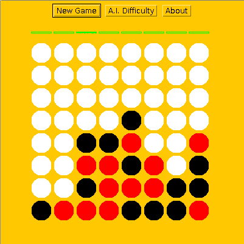

## Description

Play [Connect Four](https://en.wikipedia.org/wiki/Connect_Four) against the computer with this Java applet. Right click on the mouse to drop a piece into the selected column. After watching your piece fall the computer will make its move. The difficulty setting can be adjusted to easy, medium, or hard.

## Download

* Download: [zip](https://github.com/jostmey/ConnectFour/zipball/master)
* Git: `git clone https://github.com/jostmey/ConnectFour`

## Compile

Make sure a Java Developer Kit (JDK) has first been installed such as Open JDK. Installation instructions for Open JDK may be found [here](http://openjdk.java.net/install/) but be sure to install the *developer package*, not the runtime environment. The program has been tested on OpenJDK 7 but is expected to work on more recent versions.

To compile the code from the command line terminal, set the working directory to this folder and run the following command.

`javac GameEngine.java InterfaceEngine.java -d bin/`

## Run

If your browser supports java applets then you can use it to run the program simply by opening the file `ConnectFour.html`. Alternatively, you can run the program from the command line terminal. Set the working directory to this folder and run the following command.

`appletviewer ConnectFour.html`

## How It Works

The program searches every possible move several turns into the future looking for "traps". A trap is a condition in the game such that no matter what you do the computer can still win. The program will pick the move that offers the greatest possibility of laying a trap to catch you while at the same time trying to avoid any traps you set for it. As the program searches for its best move, the algorithm used to score each move assumes that you will pick the optimal move. In this respect, the underlying algorithm resembles the [minimax alrogithm](https://en.wikipedia.org/wiki/Minimax).
